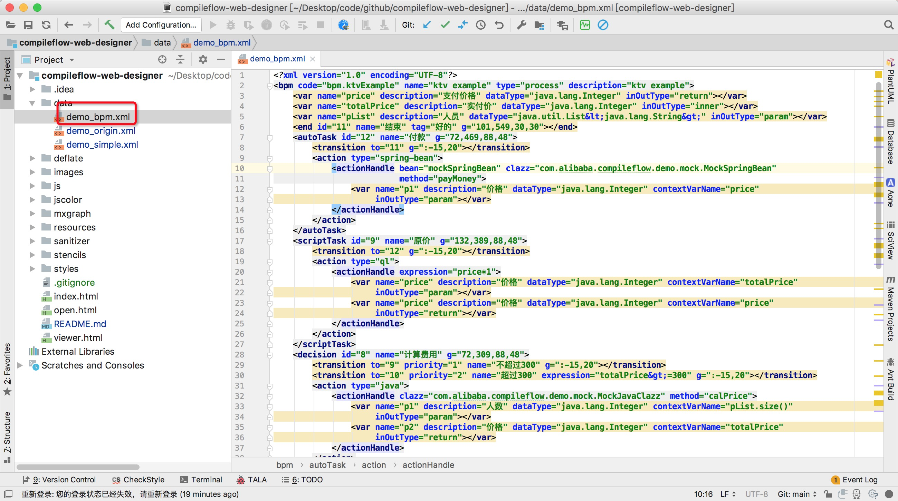
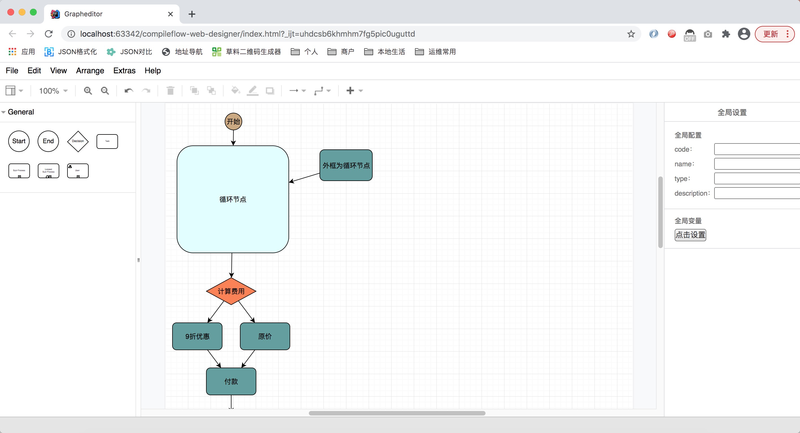

# 项目说明
该项目是compileflow引擎的web版设计器。纯js工程。方便用户集成到自己的工程中。

# 项目依赖
在https://github.com/jgraph/mxgraph基础上进行改造。

# 预览方式
这是一个存js工程，可以部署到任何服务器预览。例如，开发时，可以使用idea打开。然后访问index.html即可。替换data/demo_bpm.xml文件就可以查看你的bpm流程了。

# 改造说明
js/CompileFlowApi.js 里面有两个方法，可以加载bpm数据，以及界面变更时，数据变更通知
js/CompileFlowCodec.js 模型转换
js/CompileFlowUtils.js 工具类

# 效果截图

# Action
目前主要展示流程，还不支持编辑，以及循环节点内部展示。后续持续完善

